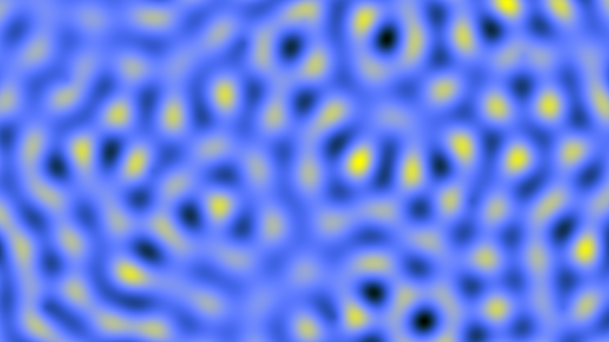

# Wave Interference

Nine circular wave sources superimposed analytically across the canvas. Constructive interference nodes glow yellow-white while destructive zones collapse to black, forming a dense honeycomb of standing waves — a still snapshot of pure wave physics rendered as generative art.
