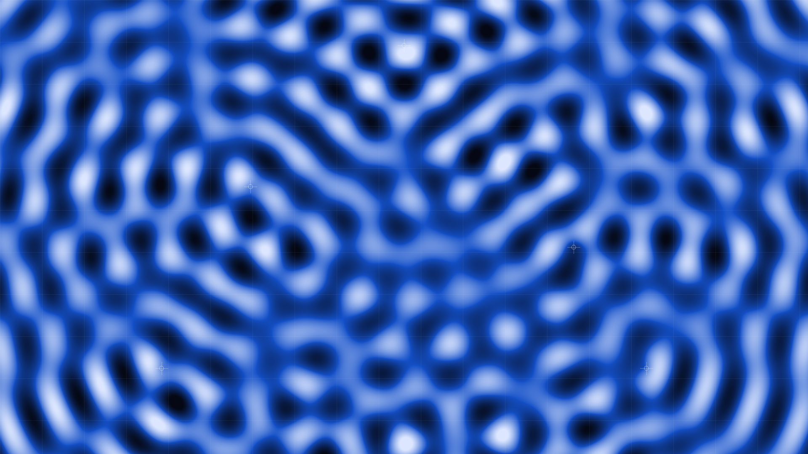

# wave_interference

## Metadata
- **Date**: 2026-04-25
- **Theme**: physics, wave phenomena.
- **Technique**: wave superposition, analytical computation, numpy vectorization.
- **Logic Lab Reference**: None

## Concept
Nine wave sources superimposed to form a standing wave interference pattern with yellow constructive nodes on a blue field.

## Technical Details
- **Renderer**: P2D
- **Simulation**: NumPy.
- **Visuals**: dark-field contrast.
- **Animation**: Still image
