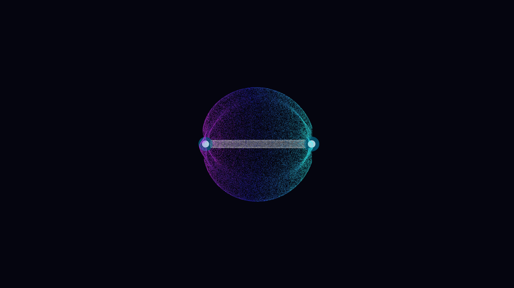

# weyl_semimetal_fermi_arcs

## Metadata
- **Date**: 2026-05-12
- **Theme**: Topological matter, Weyl semimetals, Fermi arcs, chiral Weyl nodes, momentum-space topology.
- **Technique**: 3D particle simulation (120,000 tracers). Two centers of attraction/repulsion representing Weyl nodes. Particles follow "Fermi arc" trajectories—semicircular or elliptic paths on a surface in momentum space. Multi-pass additive rendering with P3D projection. 20s 4K/60fps MP4 (1080p source).
- **Logic Lab Reference**: None

## Concept
Two blindingly bright Weyl nodes float in an obsidian momentum-space void, connected by a shimmering, pulsing shell of iridescent Fermi arcs in cyan and magenta.

## Technical Details
- **Renderer**: P3D
- **Simulation**: particle, 3D particle.
- **Visuals**: additive blending, bloom-like highlights, dark-field contrast.
- **Animation**: 20 seconds at 60fps
