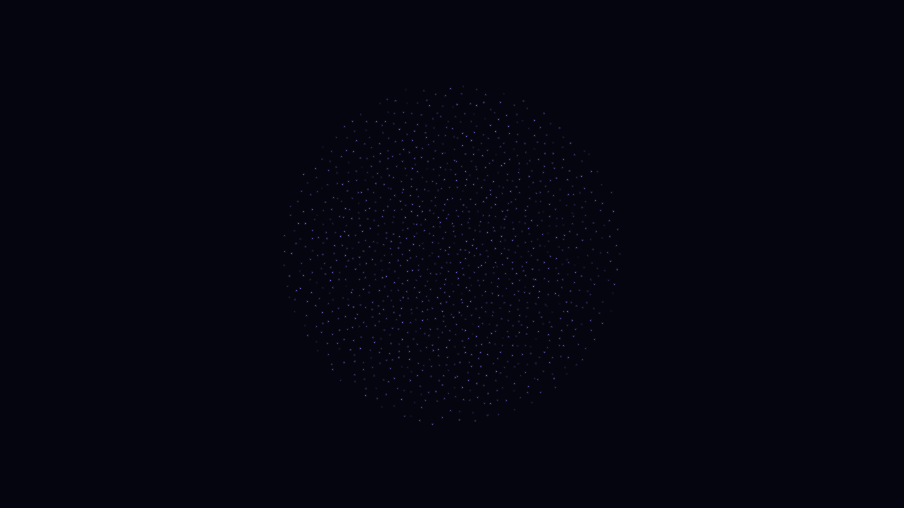

# wigner_crystal_melting

## Metadata
- **Date**: 2026-05-13
- **Theme**: Quantum phase transition, Wigner crystallization, melting, Coulomb repulsion, collective dynamics.
- **Technique**: 2D particle simulation with $1/r$ repulsive forces and a harmonic trap. Brownian dynamics with time-varying temperature. Vectorized NumPy physics. 20s 4K/60fps MP4.
- **Logic Lab Reference**: None

## Concept
A rigid, shimmering hexagonal lattice of blue-white stars that slowly vibrates, develops defects, and eventually melts into a chaotic, swirling sea of violet and cyan light as the quantum temperature rises.

## Technical Details
- **Renderer**: P2D
- **Simulation**: Vectorized NumPy, NumPy, particle.
- **Visuals**: layered py5 drawing.
- **Animation**: 20 seconds at 60fps
